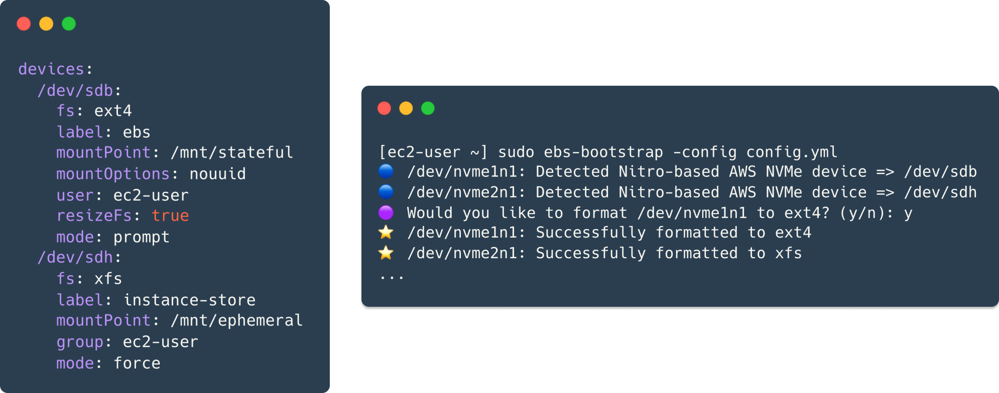

# ebs-bootstrap



`ebs-bootstrap` is a tool that provides a **safe** and **as-code** approach for managing block devices on AWS EC2. It supports the following block device operations...

* **Format** a file system
* **Label** a file system
* **Resize** a file system (when a threshold is reached)
* **Mount** a block device
* **Ownership** and **Permissions** management of the mount point

Currently, the following following file systems are supported for querying and modification...

* `ext4`
* `xfs`

Block device mappings can be [unpredictable](https://docs.aws.amazon.com/AWSEC2/latest/UserGuide/device_naming.html#device-name-limits) for AWS Nitro EC2 Instance types. `ebs-bootstrap` is equipped with the tools to recover the originally assigned block device mappings (`/dev/sd[a-z]`) from the dynamically allocated device names (`/dev/nvme[0-26]n1`) produced by **EBS** and **Instance Store** volumes. The consistent as-code management of block devices, is only possible by the ability of `ebs-bootstrap` to recover a device name that is stable across reboots and instance refreshes.

## Build

`ebs-bootstrap` is a **statically-compiled** binary that can be built for both `linux/amd64` and `linux/arm64`. This process is facilitated by a multi-architecture Docker build process.

```bash
# Specific Architecture
./build/docker.sh --architecture arm64
ls -la
... ebs-bootstrap-linux-aarch64

# All Architectures
./build/docker.sh
ls -la
... ebs-bootstrap-linux-aarch64
... ebs-bootstrap-linux-x86_64
```

## Installation

The latest binary of `ebs-bootstrap` can be downloaded from [GitHub Releases](https://github.com/reecetech/ebs-bootstrap/releases)

```
curl -L \
  -o /tmp/ebs-bootstrap \
  "https://github.com/reecetech/ebs-bootstrap/releases/latest/download/ebs-bootstrap-linux-$(uname -m)"
sudo install -m755 /tmp/ebs-bootstrap /usr/local/sbin/ebs-bootstrap
```

## Modes

## Configuration

## Applications

### `systemd`

A potential way of operating `ebs-bootstrap` is through a `systemd` service. This is so we can configure it as a `oneshot` service type that executes after the file system is ready and after `clout-init.service` writes any config files to disk. The latter is essential as `ebs-bootstrap` consumes a config file that is located at `/etc/ebs-boostrap/config.yml` by default. 

`ExecStopPost=-...` con point towards a script that is executed when the `ebs-bootstrap` service exits on either success or failure. This is a suitable place to include logic to notify an engineer that the configured devices failed their relevant healthchecks and the underlying application failed to launch in the process.

```ini
[Unit]
Description=EBS Bootstrap
After=local-fs.target cloud-init.service

[Service]
Type=oneshot
RemainAfterExit=true
StandardInput=null
ExecStart=/usr/local/sbin/ebs-bootstrap
PrivateMounts=no
MountFlags=shared
ExecStopPost=-/etc/ebs-bootstrap/post-hook.sh

[Install]
WantedBy=multi-user.target
```

```
cat /etc/ebs-bootstrap/post-hook.sh
#!/bin/sh
if [ "${EXIT_STATUS}" = "0" ]; then
    echo "🟢 Post Stop Hook: Success"
else
    echo "🔴 Post Stop Hook: Failure"
fi
```

It is then possible to configure another `systemd` service to only start if the `ebs-bootstrap` service is successful. Certain databases support the ability to spread database chunks across multiple devices that need to be mounted to pre-defined directories with the correct ownership and permissions. In this particular use-case, the database could be configured as a `systemd` service that relies on the `ebs-bootstrap.service` to succeed before attempting to start. This can be achieved by specifiying `ebs-boostrap.service` as a dependency in the `Requires=` and `After=` parameters.

```ini
[Unit]
Description=Example Database
Wants=network-online.target
Requires=ebs-bootstrap.service
After=network.target network-online.target ebs-bootstrap.service

[Service]
Type=forking
User=ec2-user
Group=ec2-user
ExecStart=/usr/bin/database start
ExecStop=/usr/bin/database stop

[Install]
WantedBy=multi-user.target
```

### `cloud-init`

By default, `ebs-bootstrap` consumes a configuration file located at `/etc/ebs-boostrap/config.yml`. `cloud-init` can be configured to write a config to this location, using the `write_files` module. Ensure that `ebs-bootstrap` is installed on your Instance via the process of baking it into your Golden AMI or downloading it early in the boot process, using the `runcmd` module.

The advent of Instance Store provided Nitro-enabled EC2 instances the ability to harness the power of high speed NVMe. However, these Instance Store devices were ephemeral and had to be formatted and mounted on each startup cycle. For a stateful workload like a database, you might want a fast and ephemeral space for temporary tables, alongside a stateful EBS volume declared in a different CloudFormation Stack, separate from your compute.

From the perspective of a **sceptical** Platforms Engineer, you do not mind a tool like `ebs-bootstrap` automating the task of formatting and mounting an ephemeral device. However, you personally draw the line on automation executing modifications to a stateful device, **without** the prior consent of a human. `ebs-bootstrap` empowers this Platform Engineer by allowing them to specify the execution mode, on a **device-by-device** basis: Instance Store (`force`) and EBS Volume (`healthcheck`)

```yaml
Resources:
  Instance:
    Type: AWS::EC2::Instance
  ...
  InstanceType: m5ad.large  # Nitro Instance Type
  Volumes:
    - Device: /dev/sdb  # EBS Volume (Stateful)
      VolumeId: !ImportValue EbsVolumeId
  BlockDeviceMappings:
    - DeviceName: /dev/sdc  # Instance Store (Ephemeral)
      VirtualName: ephemeral0
  UserData:
    Fn::Base64: !Sub
      - |+
        #cloud-config
        write_files:
          - content: |
              devices:
                /dev/sdb:
                  fs: ${FileSystem}
                  mountPoint: /mnt/ebs
                  mountOptions: ${MountOptions}
                  user: ec2-user
                  group: ec2-user
                  permissions: 755
                  label: stateful
                  mode: healthcheck
                /dev/sdc:
                  fs: ${FileSystem}
                  mountPoint: /mnt/instance-store
                  mountOptions: ${MountOptions}
                  user: ec2-user
                  group: ec2-user
                  permissions: 755
                  label: ephemeral
                  mode: force
            path: /etc/ebs-bootstrap/config.yml
        runcmd:
          - curl -L -o /tmp/ebs-bootstrap "${EbsBootstrapUrlPrefix}-$(uname -m)"
          - install -m755 /tmp/ebs-bootstrap /usr/local/sbin/ebs-bootstrap
        bootcmd:
          - /usr/local/sbin/ebs-bootstrap
      - FileSystem: ext4
        MountOptions: defaults,nofail,x-systemd.device-timeout=5
        EbsBootstrapUrlPrefix: >
          https://github.com/reecetech/ebs-bootstrap/releases/download/latest/ebs-bootstrap-linux
```

## Architecture
